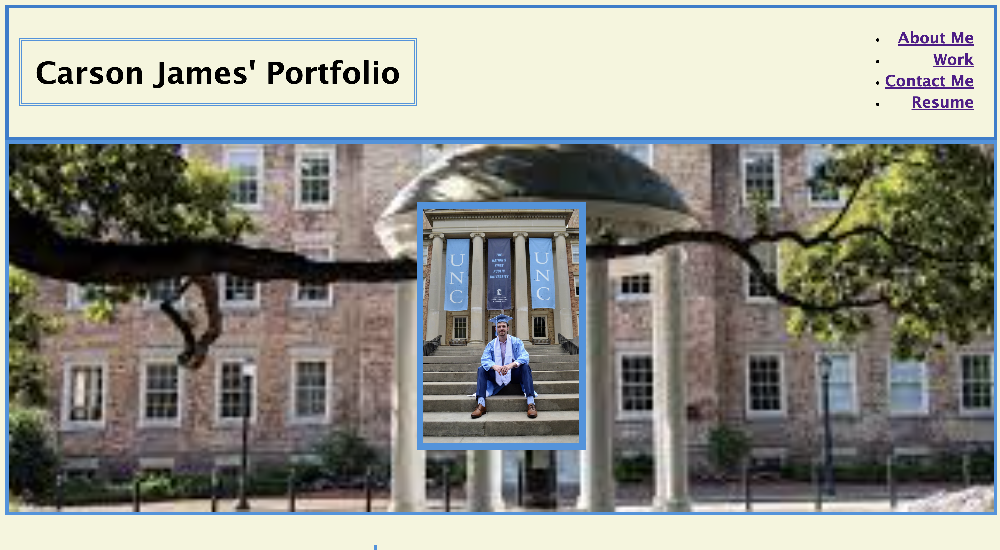
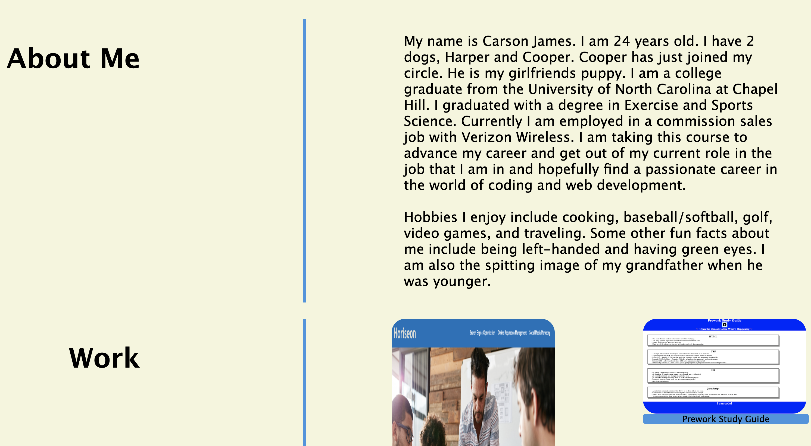
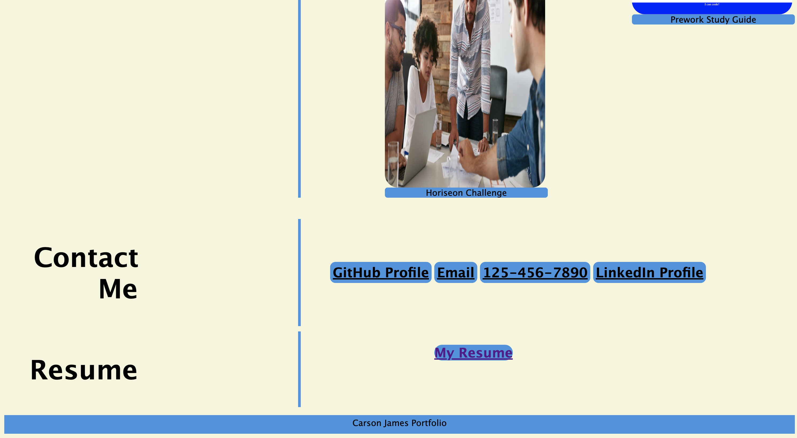

# Carson James' Portfolio
---

## Description

---

In this challenge for the week I was tasked with the job of putting together a portfolio with a title, nav bar, separate sections with descriptions and images to detail those sections. I built this project to learn more about CSS styling and HTML formatting. The problem this solved was that i know have a webpage that has GitHub links to some of my work, my Resume, my contact info, and a little description of me all in one place. I learned more about the usage of CSS and HTML properties and how they format and design a website. 

## Table of Contents

N/A

---

## Installation

I created the index.html and added my content to the document. After that, I used the CSS style sheet to give my page styling to make the content more visually appealing. Whilst doing both the HTML and CSS, I added photos to the two documents to fulfill the requirements and added extra styling. Once both the CSS and HTML documents were finished, I did my final git push function to my repository. Once thse loaded I used Github pages to push the repository live. 

---

## Usage

In these screenshots you will see the final draft of the website. You may see that some of the links are purple from testing those links. The nav bar links at the top of the screen accurately go to the proper section they are designed to in the page. For the other links with the photos of the work, the specific repositories are linked there also. Lastly, i have working links for my full github, email, and LinkedIn. I even have a working pdf for my resume. 

---

## Credits

https://www.w3schools.com/tags/tag_nav.asp

https://www.w3schools.com/tags/att_a_href.asp

https://www.w3schools.com/css/css3_multiple_columns.asp

https://www.w3schools.com/howto/howto_css_topnav_right.asp

https://www.google.com/imgres?imgurl=https%3A%2F%2Fwww.unc.edu%2Fwp-content%2Fuploads%2F2021%2F07%2F020419_old_well_summer004-scaled-e1625573140177.jpg&tbnid=Z0zKoxai-ZZD2M&vet=12ahUKEwj7wdiKh8r-AhUrk4QIHTylAh0QMygAegUIARDsAQ..i&imgrefurl=https%3A%2F%2Fwww.unc.edu%2F&docid=DYIEebYFFX-rgM&w=2201&h=1353&q=unc%20chapel%20hill&ved=2ahUKEwj7wdiKh8r-AhUrk4QIHTylAh0QMygAegUIARDsAQ

https://www.w3schools.com/css/css3_borders.asp

---

## License

MIT License

Copyright (c) [2023] [Carson James]

Permission is hereby granted, free of charge, to any person obtaining a copy
of this software and associated documentation files (the "Software"), to deal
in the Software without restriction, including without limitation the rights
to use, copy, modify, merge, publish, distribute, sublicense, and/or sell
copies of the Software, and to permit persons to whom the Software is
furnished to do so, subject to the following conditions:

The above copyright notice and this permission notice shall be included in all
copies or substantial portions of the Software.

THE SOFTWARE IS PROVIDED "AS IS", WITHOUT WARRANTY OF ANY KIND, EXPRESS OR
IMPLIED, INCLUDING BUT NOT LIMITED TO THE WARRANTIES OF MERCHANTABILITY,
FITNESS FOR A PARTICULAR PURPOSE AND NONINFRINGEMENT. IN NO EVENT SHALL THE
AUTHORS OR COPYRIGHT HOLDERS BE LIABLE FOR ANY CLAIM, DAMAGES OR OTHER
LIABILITY, WHETHER IN AN ACTION OF CONTRACT, TORT OR OTHERWISE, ARISING FROM,
OUT OF OR IN CONNECTION WITH THE SOFTWARE OR THE USE OR OTHER DEALINGS IN THE
SOFTWARE.

---

## Badges

n/a

## Features

n/a

## How to Contribute

n/a

## Tests

n/a
